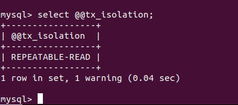
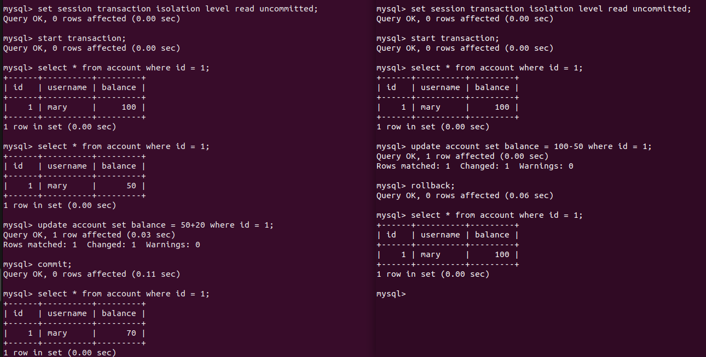
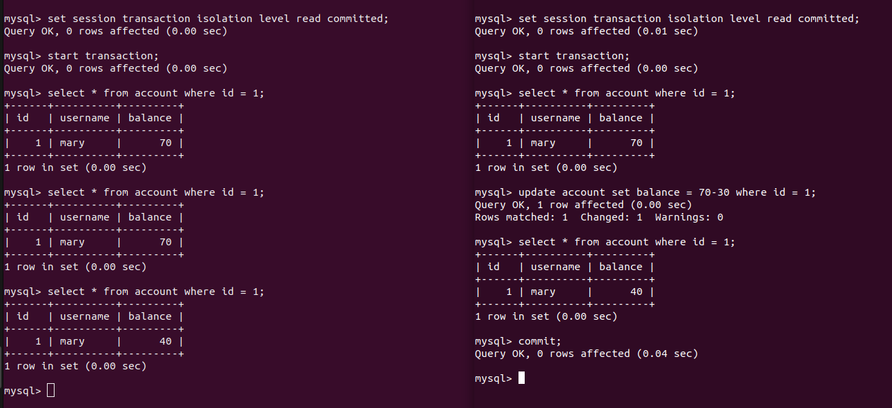
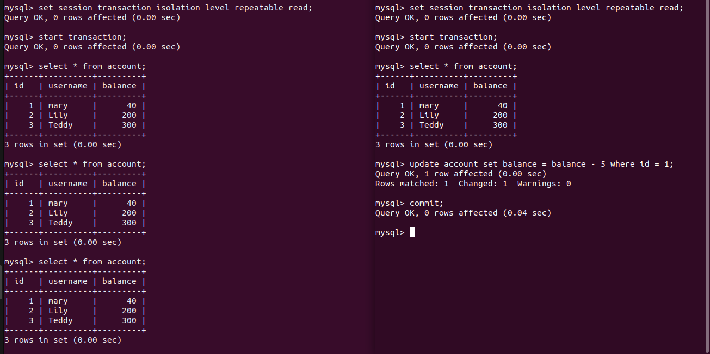
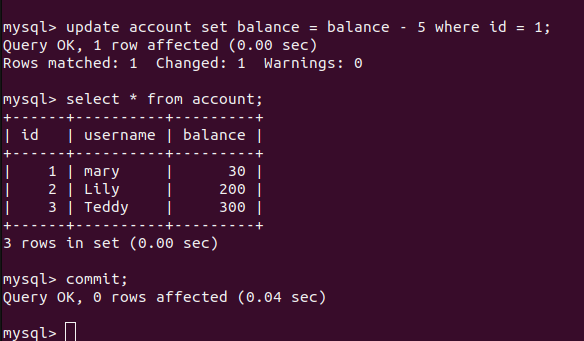
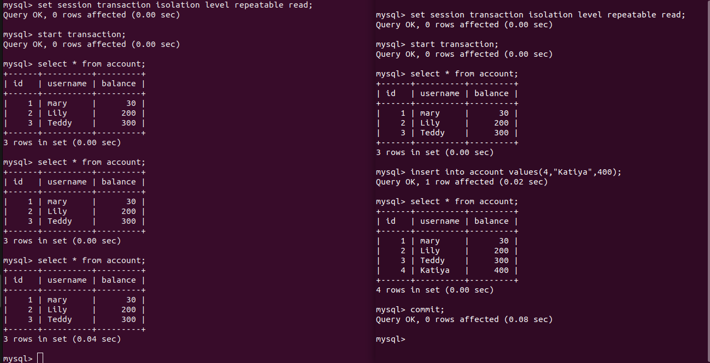
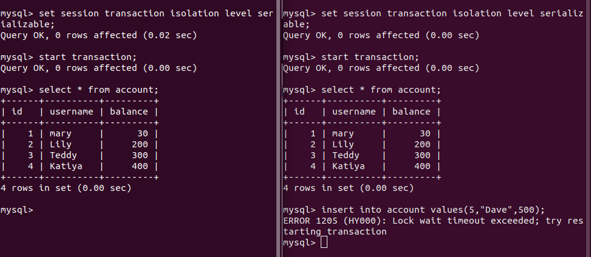

# MySQL事务隔离级别

> https://www.cnblogs.com/huanongying/p/7021555.html

## 一、默认隔离级别

输入` select @@tx_isolation;`

## 二、四种隔离级别

### 1、读未提交

在右边事务提交前，左边可以读到右边修改的数据 `update account set balance = 100-50 where id = 1`，这样，右边回滚后，会导致左边使用了右边修改的脏数据进行操作 `update account set balance = 50+20 where id 1`，这就导致 `脏读`。

### 2、读提交

在右边修改数据 `update account set balance = 70-30 where id = 1` 还未提交时，左边执行 `select * from account where id = 1`还是得到以前的数据；当右边提交后，左边执行 `select * from account where id = 1`得到的就是提交后的数据 `40`，这就导致两次读到的数据不一致，导致 `不可重复读`。

### 3、可重复读

右边执行 `update account set balance = balance-5 where id = 1`语句包括提交前后，左边执行 `select * from account`都和之前值一样，这解决了 `不可重复读` 问题。

继续，昨天执行 `update account set balance = balance - 5 where id = 1;` 之后，结果是30而不是35.原因在于：**可重复读的隔离级别下使用了MVCC机制，select操作不会更新版本号，是快照读（历史版本）；insert、update和delete会更新版本号，是当前读（当前版本）**

由上图可见，右边执行 `insert into account values(4,"Katiya",400)`语句包括提交前后，左边执行 `select * from account`语句的总条数都不变，并没有导致 `幻读`问题。

### 4、序列化

当为 `序列化`级别时，右边事务无法执行 `insert` 操作。