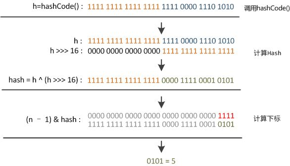

# HashMap

> <https://blog.csdn.net/fan2012huan/article/details/51097331>

## 一、简介

1. 实现Map接口

2. 支持null类型的key和value

3. 和**Hashtable**相比，它**不是synchronized**，并且它支持null

4. 不保证顺序性

5. 最重要两个参数：**初始容量、负载因子**（初始容量指桶的数量）

6. 扩容时，**桶数量为原来的2倍**

7. 负载因子默认为**0.75**，该值在时间和空间中有个平衡，太高减少空间开销，但是会增加查找成本，包括get和put。当数量大于**初始容量*负载因子**时，会rehash。

8. ```java
   Map m = Collections.synchronizedMap(new HashMap(...))
   ```

9. **fail-fast**机制：多线程在原集合上操作，会抛出ConcurrentModificationException，迭代器会迅速失效
10. 与之相关：**TreeMap**、**Hashtable**

## 二、解析

1. 初始容量为16，必须是2的倍数；最大容量为1<<30；

   `static final int DEFAULT_INITIAL_CAPACITY = 1 << 4; // aka 16`

   `static final int MAXIMUM_CAPACITY = 1 << 30;`

2. 链表长度大于8后会转换成红黑树，红黑树长度小于6后会转换成链表

   `static final int TREEIFY_THRESHOLD = 8;`

   `static final int UNTREEIFY_THRESHOLD = 6;`

   为什么要**TREEIFY_THRESHOLD = 8**？

   当hash效果很好的时候，一个桶中的节点频率遵从泊松分布，当频率为8的时候，概率（亿分之一）已经很小了，这是个概率统计值。

   为什么要**UNTREEIFY_THRESHOLD = 6**？【我猜】

   如果为8时转换成链表，可能很快它又需要转换成红黑树，频繁转换增大开销。泊松分布在频率为6的地方是个分界。频率大于6时，概率很小，频率小于6时，概率大很多（千分之一）

3. `static class Node<K,V> implements Map.Entry<K,V>`中`equals`方法会调用`obejct.equals`方法（如果该方法没被重写）

   ```java
   public boolean equals(Object obj) {
       return (this == obj);
   }
   ```

4. **hash函数**

   ```java
   static final int hash(Object key) {
       int h;
       return (key == null) ? 0 : (h = key.hashCode()) ^ (h >>> 16);
   }
   ```

   计算key的hashCode，然后将高比特位转成低比特位（异或）

   **为什么进行异或运算？**

   （1）该函数为扰动函数，使高位和低位一起参与计算，加大低位的随机性

   （2）`(n - 1) & hash`，除去所有高位，剩下所有低位

   

5.**tableSizeFor函数**

```java
static final int tableSizeFor(int cap) {
    int n = cap - 1;
    n |= n >>> 1;
    n |= n >>> 2;
    n |= n >>> 4;
    n |= n >>> 8;
    n |= n >>> 16;
    return (n < 0) ? 1 : (n >= MAXIMUM_CAPACITY) ? MAXIMUM_CAPACITY : n + 1;
}
```

用来获得比cap大的最小2的倍数


6. **transient**

   ```java
   transient Node<K,V>[] table;
   transient Set<Map.Entry<K,V>> entrySet;
   ```

transient表示该域不会被串行化（序列化），因为key在hash后映射到对应桶，由于不同JVM在执行object.hashCode()的处理方式可能是不一样的，该方法是native方法，所以可能导致同样的key在不同JVM中可能会映射到不同的桶，如果在不同JVM对该域进行反序列化的时候可能会出现严重错误。