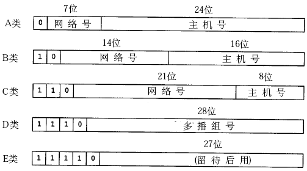

# 网络协议分层

| 5层协议 | 7层协议    | 作用                         | 协议                     | 其他                  |
| ------- | ---------- | ---------------------------- | ------------------------ | --------------------- |
| 应用层  | 应用层     | 为应用程序提供服务           | HTTP/HTTPS/FTP/SMTP/POP3 |                       |
| 应用层  | 表示层     | 数据格式转换，数据加密       |                          |                       |
| 应用层  | 会话层     | 建立，管理，维护会话         |                          |                       |
| 传输层  | 传输层     | 建立，管理和维护端到端的连接 | TCP/UDP                  | 差错控制/流量控制     |
| 网络层  | 网络层     | IP选址和路由选择             | IP/ARP/RARP              | 路由器                |
|         | 数据链路层 | 提供介质访问和链路管理       |                          | MAC/LLC子层，差错检测 |
|         | 物理层     | 物理                         |                          |                       |

## 一.  网络层

IP不是可靠的协议，这是说，IP协议没有提供一种数据未传达以后的处理机制

1.1 ARP工作原理：

1. 主机A的IP地址为192.168.1.1，MAC地址为0A-11-22-33-44-01；主机B的IP地址为192.168.1.2，MAC地址为0A-11-22-33-44-02；
2. 当主机A要与主机B通信时，地址解析协议可以将主机B的IP地址（192.168.1.2）解析成主机B的MAC地址，以下为工作流程：
   1. 第1步：根据主机A上的路由表内容，IP确定用于访问主机B的转发IP地址是192.168.1.2。然后A主机在自己的本地ARP缓存中检查主机B的匹配MAC地址。
   2. 第2步：如果主机A在ARP缓存中没有找到映射，它将询问192.168.1.2的硬件地址，从而将ARP请求帧广播到本地网络上的所有主机。源主机A的IP地址和MAC地址都包括在ARP请求中。本地网络上的每台主机都接收到ARP请求并且检查是否与自己的IP地址匹配。如果主机发现请求的IP地址与自己的IP地址不匹配，它将丢弃ARP请求。
   3. 第3步：主机B确定ARP请求中的IP地址与自己的IP地址匹配，则将主机A的IP地址和MAC地址[映射](https://baike.baidu.com/item/%E6%98%A0%E5%B0%84)添加到本地ARP缓存中。
   4. 第4步：主机B将包含其MAC地址的ARP回复消息直接发送回主机A。
   5. 第5步：当主机A收到从主机B发来的ARP回复消息时，会用主机B的IP和MAC地址映射更新ARP缓存。本机缓存是有生存期的，生存期结束后，将再次重复上面的过程。主机B的MAC地址一旦确定，主机A就能向主机B发送IP通信了。

1.2 IP划分

计算：

网络号=IP地址&子網掩碼

主機號是從全0到全1的地址範圍

私有IP：

- 10.*，前8位是网络号，共16,777,216个地址
- 172.16.* 到172.31.*，前12位是网络号，共1,048,576个地址
- 192.168.*，前16位是网络号，共65,536个地址

1.3 ICMP重定向報文

当IP包在某一个地方转向的时候，都回给发送IP报的源主机一个ICMP重定向报文，而源主机就可以利用这个信息来更新自己的路由表。重定向報文只能由路由器發出。重定向報文爲主機所用，而不是爲路由器所用。

## 二. 传输层

> https://blog.csdn.net/sinat_36629696/article/details/80740678

2.1 三次握手，四次挥手

三次握手：

SYN---->SYN+ACK---->ACK

四次挥手：

FIN----->ACK         FIN----->ACK

2.2 三次握手为什么不用两次？

假设第一次SYN请求由于网络原因滞留导致服务端没收到，客户端会再发起一次，之后正常连接并断开后，第一次的SYN包到达服务端，服务端会认为这是一次新的连接，如果只有两次握手，服务端收到这个报文后会返回SYN+ACK，虽然客户端不认为这次连接有效，但服务端会一直耗费资源保持这个连接。如果是三次握手，服务端在发送了SYN+ACK之后一直收不到客户端的ACK响应，则认为该连接无效，不会耗费资源。

2.3 为什么是三次握手，四次挥手？

四次挥手发送FIN报文仅表示本方不再发送数据，但对方还是可以发送数据，所以ACK和FIN 一般是分开的。

2.4 四次挥手为什么最后客户端还要等待2MSL的时间？

MSL代表报文最大生存时间，2MSL是指来回最大需要的时间，这保证了客户端发送最后一个ACK的时候，在MSL时间里，如果服务器端没有收到该报文会重传FIN报文，FIN最多生存MSL时间，从客户端发送ACK报文到FIN报文返回到客户端最多需要2MSL时间，如果这段时间内客户端没有再次收到服务端的FIN报文，表示之前发送ACK已经发送成功

2.5 超时重传？

在一个特定时间间隔内没有收到报文应答，就会进行重发

2.6 滑动窗口？

无需等待确认应答可以继续发送数据。一次性发送多条数据，当接到其中数据的确认应答后，窗口往后不断移动

2.7 流量控制？

TCP根据接收端的处理能力，来决定发送端的发送速度，告诉窗口大小。

2.8 拥塞控制？---慢启动

慢启动---指数增长到阈值---线性增长

2.9 延迟应答

2.10 捎带确认？数据和ACK一起发送

2.11 面向字节流-----粘包问题----明确应用层数据包的边界