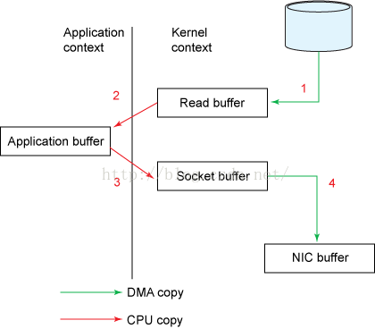
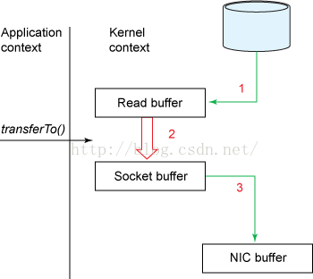

# Linux 零拷贝

零拷贝可以在某种程度上减少甚至避免不必要的CPU数据拷贝操作。

## 1. 传统方式

(1）read调用后，DMA执行一次数据拷贝，将数据从磁盘拷贝到内核缓冲区

(2）然后，CPU发生第二次数据拷贝，将数据从内核缓冲区拷贝到用户空

(3） write调用后，CPU将数据从用户空间拷贝到内核空间（socket缓冲区）

(4）之后，DMA讲数据从socket缓冲区拷贝到协议引擎

## 2. 零拷贝

（1）DMA从磁盘拷贝到内核缓冲区

（2）CPU将数据从内核缓冲区拷贝到socket缓冲区

（3）DMA将数据从socket缓冲区拷贝到协议引擎

以上，减少了CPU拷贝次数，使得CPU可以做其他工作，在高速网络（网络链接能力与CPU的处理能力相当甚至超过CPU处理能力）的情况下，可以使得CPU不止于忙于进行数据拷贝，还能提供其他处理能力