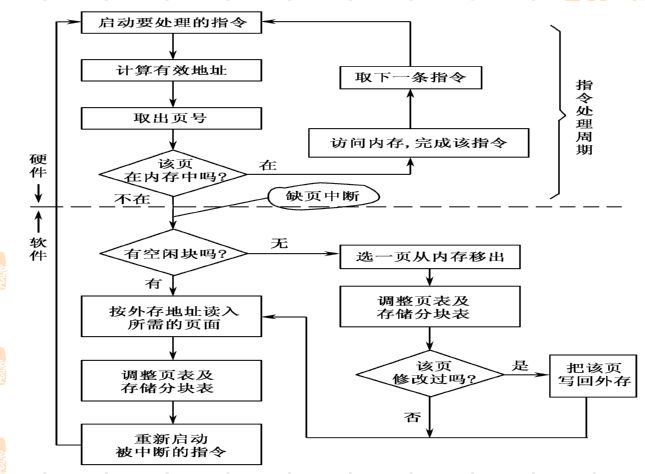

# 内存映射

> https://www.cnblogs.com/wuchanming/p/4823444.html

虚拟地址到物理地址的映射

CPU将一个虚拟内存空间中的地址转换为物理地址，需要进行两步：

（1）CPU利用段式内存管理单元，将逻辑地址转换成一个线性地址

（2）CPU利用页式内存管理单元，转换为最终物理地址

过程：

## 页表机制

状态位（中断位）：标识该页是否在内存（0或1）

访问位：标识该页面的近来的访问次数或时间（换出）

修改位：标识此页是否在内存中被修改过

外存地址：记录该页面在外存上的地址，即（外存而非内存的）物理块号

## 缺页中断机制

程序在执行时，首先检查页表，当状态位指示该页不在主存时，引起一次缺页中断：

保护现场（CPU环境）；

中断处理（中断处理程序装入页面）；

恢复现场，返回断点继续执行

## 置换算法

FIFO

LRU

LFU