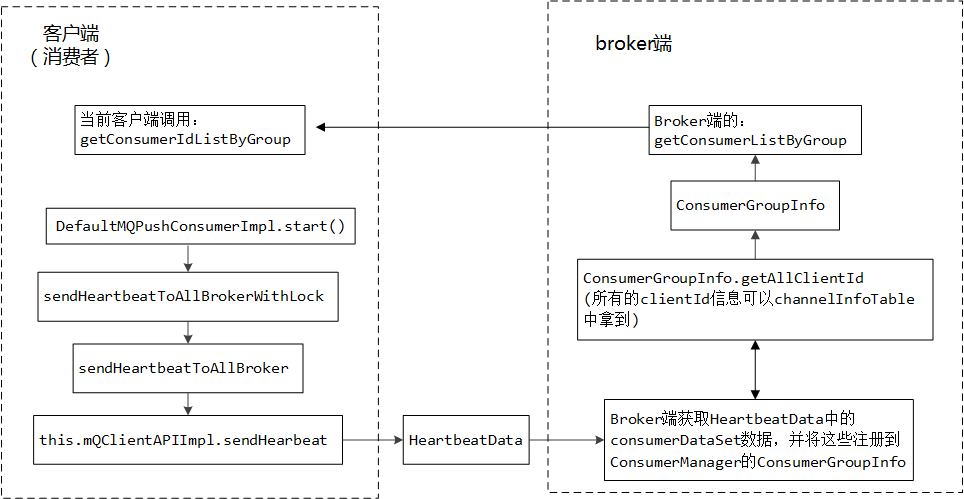
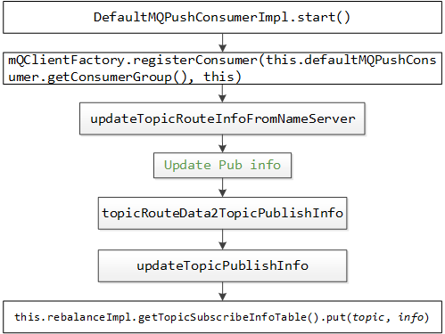

# RocketMQ负载均衡

1.1 启动，DefaultMQPushConsumerImpl

```java
public synchronized void start() throws MQClientException {
……
    //配置
    this.rebalanceImpl.setConsumerGroup(this.defaultMQPushConsumer.getConsumerGroup());
    this.rebalanceImpl.setMessageModel(this.defaultMQPushConsumer.getMessageModel());
 this.rebalanceImpl.setAllocateMessageQueueStrategy(this.defaultMQPushConsumer.getAllocateMessageQueueStrategy());
	this.rebalanceImpl.setmQClientFactory(this.mQClientFactory);
			……
                //启动
                mQClientFactory.start();
           ……	
    }
```

1.2 MQClientInstance

```java
public void start() throws MQClientException {
			……
                    // Start rebalance service
                    this.rebalanceService.start();
            ……
    }
```

1.3 RebalanceService

```java
@Override
    public void run() {
        log.info(this.getServiceName() + " service started");

        while (!this.isStopped()) {
            this.waitForRunning(waitInterval);
            //负载均衡
            this.mqClientFactory.doRebalance();
        }

        log.info(this.getServiceName() + " service end");
    }
```

1.4 MQClientInstance

```java
public void doRebalance() {
        for (Map.Entry<String, MQConsumerInner> entry : this.consumerTable.entrySet()) {
            MQConsumerInner impl = entry.getValue();
            if (impl != null) {
                try {
                    //负载均衡
                    impl.doRebalance();
                } catch (Throwable e) {
                    log.error("doRebalance exception", e);
                }
            }
        }
    }
```

1.5 RebalanceImpl

```java
public void doRebalance(final boolean isOrder) {
        Map<String, SubscriptionData> subTable = this.getSubscriptionInner();
        if (subTable != null) {
            for (final Map.Entry<String, SubscriptionData> entry : subTable.entrySet()) {
                final String topic = entry.getKey();
                try {
                    //负载均衡
                    this.rebalanceByTopic(topic, isOrder);
                } catch (Throwable e) {
                    if (!topic.startsWith(MixAll.RETRY_GROUP_TOPIC_PREFIX)) {
                        log.warn("rebalanceByTopic Exception", e);
                    }
                }
            }
        }

        this.truncateMessageQueueNotMyTopic();
    }
```

1.6 RebalanceImpl

```java
private void rebalanceByTopic(final String topic, final boolean isOrder) {
     ……
                    //分配策略
                    AllocateMessageQueueStrategy strategy = this.allocateMessageQueueStrategy;
……
                        //调用allocate方法，获取当前client分配消息队列
                        allocateResult = strategy.allocate(
                            this.consumerGroup,
                            this.mQClientFactory.getClientId(),
                            mqAll,
                            cidAll);
              ……
                    //更新updateProcessQueue
                    boolean changed = this.updateProcessQueueTableInRebalance(topic, allocateResultSet, isOrder);
                ……
    }
```



