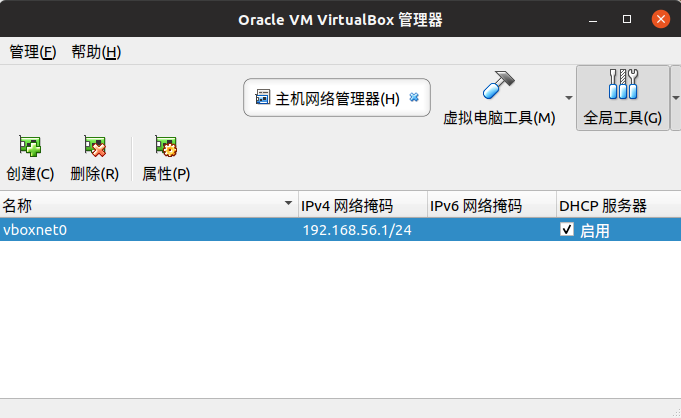
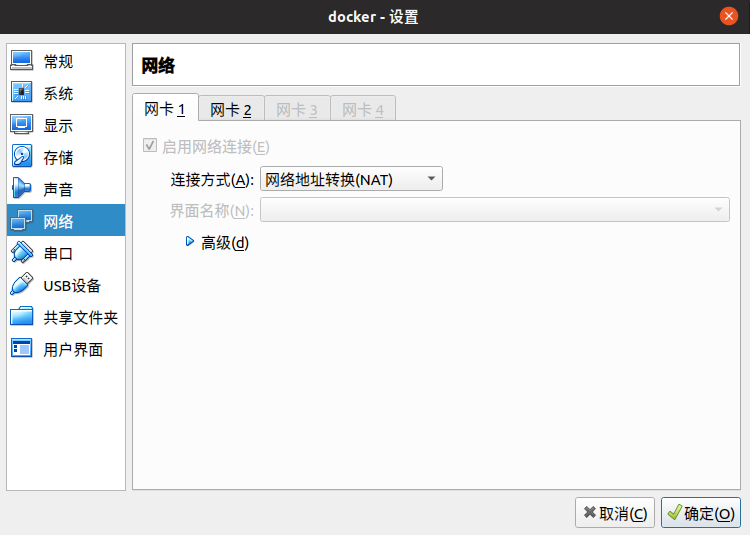
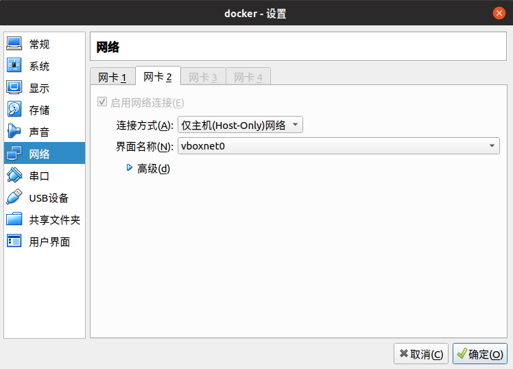

# Ubuntu下RocketMQ搭建双Master集群

> https://blog.csdn.net/qiushisoftware/article/details/78944579#commentBox
>
> https://www.cnblogs.com/hiver/p/6842341.html
>
> https://rocketmq.apache.org/docs/quick-start/
>
> https://blog.csdn.net/weixin_40533111/article/details/84451219
>
> http://www.cnblogs.com/woolhc/p/6924099.html
>
> https://blog.csdn.net/jiajiren11/article/details/80528406

一台ubuntu主机与一台ubuntu虚拟机进行搭建，以下IP根据实际情况填写

注意点：

## 1、VirtualBox使得虚拟机与主机之间能够ping通

https://www.cnblogs.com/hiver/p/6842341.html







配置成这样后，主机与虚拟机之间可以互相ping通了。

## 2、修改配置文件（主机和虚拟机的配置都修改成下面所示）

### 2.1、启动配置

防止虚拟机或主机内存不足导致无法启动，具体启动是否生效可以在RocketMQ目录下 `RocketMQ目录下/distribution/target/apache-rocketmq/binn/nohup.out` 中查看

a、RocketMQ目录下/distribution/target/apache-rocketmq/bin/runserver.sh

将其中一行修改为`JAVA_OPT="${JAVA_OPT} -server -Xms256m -Xmx256m -Xmn125m -XX:MetaspaceSize=128m -XX:MaxMetaspaceSize=320m"`

b、RocketMQ目录下/distribution/target/apache-rocketmq/bin/runbroker.sh

将其中一行修改为`JAVA_OPT="${JAVA_OPT} -server -Xms256m -Xmx256m -Xmn125m -XX:MetaspaceSize=128m -XX:MaxMetaspaceSize=320m"`

### 2.2、双master集群配置

a、RocketMQ目录下/distribution/target/apache-rocketmq/bin/conf/2m-noslave/broker-a.properties

```properties
brokerClusterName=rocketmq-cluster
brokerName=broker-a
brokerId=0
deleteWhen=04
fileReservedTime=48
brokerRole=ASYNC_MASTER
flushDiskType=ASYNC_FLUSH
#nameServer地址，分号分割，下面填主机和虚拟机的ip和端口号，分号分割
namesrvAddr=192.168.1.107:9876;192.168.56.101:9876
```

b、RocketMQ目录下/distribution/target/apache-rocketmq/bin/conf/2m-noslave/broker-b.properties

```properties
brokerClusterName=rocketmq-cluster
brokerName=broker-b
brokerId=0
deleteWhen=04
fileReservedTime=48
brokerRole=ASYNC_MASTER
flushDiskType=ASYNC_FLUSH
#nameServer地址，分号分割
namesrvAddr=192.168.1.107:9876;192.168.56.101:9876
#其中虚拟机中该配置文件需要添加下面内容
#brokerIP1当前broker监听的IP brokerIP2存在broker主从时，在broker主节点上配置brokerIP2的话，broker从节点会连接主节点配置的brokerIP2来同步
brokerIP1=192.168.56.101
```

## 3、启动

### 3.1、先分别启动name server

apache-rocketmq目录下执行 

a、`nohup sh bin/mqnamesrv &`

b、`tail -f ~/logs/rocketmqlogs/namesrv.log`

### 3.2、分别启动broker，主机使用broker-a.properties启动，虚拟机使用broker-b.properties启动

a、主机上执行 `nohup sh bin/mqbroker -c conf/2m-noslave/broker-a.properties 2>&1 &`

b、虚拟机上执行 `nohup sh bin/mqbroker -c conf/2m-noslave/broker-b.properties 2>&1 &`

c、可以通过 `tail -f ~/logs/rocketmqlogs/broker.log `查看执行日志

### 3.3、收发消息

主机上发消息，虚拟机上接收

a、主机上执行 `export NAMESRV_ADDR=192.168.56.101:9876`，然后执行 `sh bin/tools.sh org.apache.rocketmq.example.quickstart.Producer`

b、虚拟机上执行 `export NAMESRV_ADDR=192.168.56.101:9876`，然后执行 `sh bin/tools.sh org.apache.rocketmq.example.quickstart.Consumer`